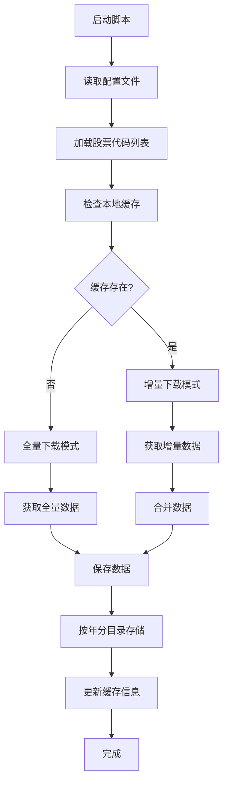

## 股票数据缓存脚本需求文档（聚宽环境）

### 1. 项目概述

**目标**：在聚宽研究环境下开发一个智能的股票数据缓存脚本，通过调用聚宽API和本地缓存管理，实现高效的数据获取和存储。

**核心价值**：
- 减少聚宽API调用次数，提高研究效率
- 实现增量数据更新，避免重复计算
- 智能的存储路径管理，便于数据检索和维护
- 利用聚宽平台的高质量历史数据

### 2. 功能需求

#### 2.1 配置文件管理
- **配置格式**：支持JSON/YAML格式的配置文件
- **配置内容**：
  - 股票代码列表（支持通配符和范围选择）
  - 聚宽API参数配置（数据频率、复权方式、字段选择）
  - 缓存参数（时间范围、更新策略）
  - 存储路径配置

#### 2.2 缓存管理
- **缓存检测**：启动时检查本地缓存数据
- **增量判断**：基于时间戳和完整性检查确定下载模式
- **缓存更新**：智能合并新旧数据，避免重复
- **聚宽环境适配**：处理研究环境的数据获取限制

#### 2.3 数据获取策略
- **聚宽API集成**：直接调用 `get_price()` 函数获取历史数据
- **批量获取优化**：利用聚宽API的多标的获取能力
- **参数优化**：根据研究需求配置frequency、fields等参数
- **错误处理**：处理聚宽API的调用限制和异常情况

#### 2.4 数据存储策略
- **按年分目录**：根据股票上市年份创建目录结构
- **文件命名规范**：统一命名规则便于检索
- **数据格式**：支持CSV/Parquet等高效存储格式

### 3. 技术架构

#### 3.1 系统流程图


#### 3.2 核心模块设计

##### 配置管理模块
```python
class ConfigManager:
    - 读取和验证配置文件
    - 提供配置参数访问接口
    - 支持配置热更新
```

##### 缓存管理模块  
```python
class CacheManager:
    - 检查本地缓存状态
    - 判断下载模式（全量/增量）
    - 管理缓存元数据
    - 处理数据合并逻辑
```

##### 数据获取模块
```python
class DataFetcher:
    - 聚宽API调用封装（get_price、get_security_info等）
    - 数据频率和复权参数配置
    - 数据校验和清洗
    - 错误处理和日志记录
    - 研究环境适配
```

##### 存储管理模块
```python
class StorageManager:
    - 目录结构创建
    - 文件命名和存储
    - 数据压缩和优化
    - 存储状态监控
```

### 4. 详细设计

#### 4.1 配置文件结构
```yaml
# config.yaml
stocks:
  - 600519.XSHG  # 贵州茅台
  - 000001.XSHE  # 平安银行
  - "60*.XSHG"   # 沪市主板
  - "00*.XSHE"   # 深市主板

jqdata:
  start_date: "2010-01-01"
  end_date: "2025-12-04" 
  frequency: "daily"  # daily/weekly/monthly/minute
  fields: ["open", "high", "low", "close", "volume"]
  fq: "pre"  # 复权方式: pre/post/None
  skip_paused: false
  fill_paused: true

cache:
  update_strategy: "incremental"  # incremental/full
  auto_update: true
  check_interval: "daily"  # daily/weekly/monthly

storage:
  base_path: "./data"
  format: "parquet"
  compression: "snappy"
  by_listing_year: true  # 按上市年份分目录
```

#### 4.2 缓存元数据结构
```json
{
  "stock_code": "600519.XSHG",
  "last_update": "2025-12-03 15:00:00",
  "data_range": {
    "start_date": "2010-01-01",
    "end_date": "2025-12-03"
  },
  "file_path": "./data/2001/600519.XSHG.parquet",
  "checksum": "md5_hash"
}
```

#### 4.3 目录结构设计
```
data/
├── 1990/          # 1990年上市股票
│   ├── 000001.XSHE.parquet
│   └── 000002.XSHE.parquet
├── 2001/          # 2001年上市股票  
│   └── 600519.XSHG.parquet
├── 2020/          # 2020年上市股票
│   └── 688001.XSHG.parquet
└── cache_meta.json  # 缓存元数据文件
```

### 5. 性能优化策略

#### 5.1 聚宽API调用优化
- **批量获取**：利用聚宽API的多标的获取能力
- **参数优化**：合理设置frequency、fields等参数减少数据量
- **内存管理**：分批处理大量股票数据
- **环境适配**：适应聚宽研究环境的运行特性

#### 5.2 存储优化
- **列式存储**：使用Parquet格式减少IO
- **数据分区**：按时间分区提高查询效率
- **索引构建**：为常用查询字段建立索引

#### 5.3 内存管理
- **流式处理**：避免大文件内存占用
- **分块下载**：支持大文件断点续传
- **垃圾回收**：及时释放不再使用的资源

### 6. 错误处理和监控

#### 6.1 错误处理策略
- **聚宽API异常**：处理API调用限制和超时
- **数据异常**：数据校验和修复机制
- **存储异常**：磁盘空间检查和清理
- **环境限制**：处理研究环境的资源限制

#### 6.2 监控指标
- **下载进度**：实时显示下载状态
- **性能指标**：下载速度、成功率统计
- **资源使用**：内存、磁盘、网络监控

### 7. 扩展性考虑

#### 7.1 插件架构
- 支持多种聚宽数据源函数（get_price、get_security_info等）
- 可配置的存储后端
- 自定义数据处理管道
- 聚宽研究环境适配器

#### 7.2 配置热更新
- 运行时配置修改
- 动态股票列表更新
- 下载参数调整

### 8. 下一步工作

### 9. 聚宽环境集成说明

#### 9.1 聚宽API使用规范
- **数据获取函数**：直接调用 `get_price()` 获取历史K线数据
- **标的信息查询**：使用 `get_security_info()` 获取股票基本信息
- **参数配置**：严格按照聚宽API规范设置各参数
- **环境限制**：遵守聚宽研究环境的调用频率和数据范围限制

#### 9.2 研究环境适配
- **数据同步**：利用聚宽的实时数据特性
- **版本兼容**：确保与当前聚宽API版本兼容
- **权限管理**：使用研究环境提供的数据权限

### 10. 下一步工作

基于这个需求文档，下一步将进行：
1. **技术选型**：确定具体的Python库和工具（主要基于聚宽研究环境）
2. **聚宽API集成**：详细设计get_price等函数的调用接口
3. **详细设计**：每个模块的接口和实现细节
4. **开发计划**：制定开发里程碑和时间表

您对这个需求文档有什么修改建议吗？或者是否需要我针对某个特定部分进行更详细的设计？