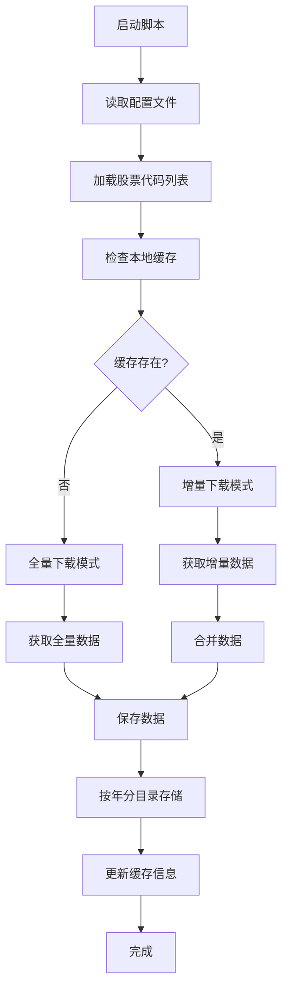

# 股票K线数据下载脚本需求文档

## 1. 项目概述

**目标**：开发一个智能的股票K线数据下载脚本，通过优化API调用和本地缓存管理，实现高效的数据获取和存储。

**核心价值**：
- 减少API调用次数，降低网络流量成本
- 实现增量下载，避免重复数据获取
- 智能的存储路径管理，便于数据检索和维护

## 2. 功能需求

### 2.1 配置文件管理
- **配置格式**：支持JSON/YAML格式的配置文件
- **配置内容**：
  - 股票代码列表（支持通配符和范围选择）
  - API配置（密钥、端点、限流参数）
  - 下载参数（时间范围、数据频率、重试策略）
  - 存储路径配置

### 2.2 缓存管理
- **缓存检测**：启动时检查本地缓存数据
- **增量判断**：基于时间戳和完整性检查确定下载模式
- **缓存更新**：智能合并新旧数据，避免重复

### 2.3 数据存储策略
- **按年分目录**：根据股票上市年份创建目录结构
- **文件命名规范**：统一命名规则便于检索
- **数据格式**：支持CSV/Parquet等高效存储格式

## 3. 技术架构

### 3.1 系统流程图


### 3.2 核心模块设计

#### 配置管理模块
```python
class ConfigManager:
    - 读取和验证配置文件
    - 提供配置参数访问接口
    - 支持配置热更新
```

#### 缓存管理模块
```python
class CacheManager:
    - 检查本地缓存状态
    - 判断下载模式（全量/增量）
    - 管理缓存元数据
    - 处理数据合并逻辑
```

#### 数据下载模块
```python
class DataDownloader:
    - API调用封装
    - 限流和重试机制
    - 数据校验和清洗
    - 错误处理和日志记录
```

#### 存储管理模块
```python
class StorageManager:
    - 目录结构创建
    - 文件命名和存储
    - 数据压缩和优化
    - 存储状态监控
```

## 4. 详细设计

### 4.1 配置文件结构
```yaml
# config.yaml
stocks:
  - 600519.XSHG  # 贵州茅台
  - 000001.XSHE  # 平安银行
  - "60*.XSHG"   # 沪市主板
  - "00*.XSHE"   # 深市主板

api:
  endpoint: "https://api.example.com"
  key: "your_api_key"
  rate_limit: 10  # 每秒请求数
  retry_times: 3

download:
  start_date: "2010-01-01"
  end_date: "2025-12-04" 
  frequency: "daily"  # daily/weekly/monthly
  fields: ["open", "high", "low", "close", "volume"]

storage:
  base_path: "./data"
  format: "csv"
  compression: "none"
```

### 4.2 缓存元数据结构
```json
{
  "stock_code": "600519.XSHG",
  "last_update": "2025-12-03 15:00:00",
  "data_range": {
    "start_date": "2010-01-01",
    "end_date": "2025-12-03"
  },
  "file_path": "./data/2001/600519.XSHG.parquet",
  "checksum": "md5_hash"
}
```

### 4.3 目录结构设计
```
data/
├── 1990/          # 1990年上市股票
│   ├── 000001.XSHE.parquet
│   └── 000002.XSHE.parquet
├── 2001/          # 2001年上市股票  
│   └── 600519.XSHG.parquet
├── 2020/          # 2020年上市股票
│   └── 688001.XSHG.parquet
└── cache_meta.json  # 缓存元数据文件
```

## 5. 性能优化策略

### 5.1 API调用优化
- **批量请求**：支持多股票同时下载
- **连接池**：复用HTTP连接
- **压缩传输**：启用gzip压缩
- **缓存头**：利用ETag/Last-Modified

### 5.2 存储优化
- **列式存储**：使用Parquet格式减少IO
- **数据分区**：按时间分区提高查询效率
- **索引构建**：为常用查询字段建立索引

### 5.3 内存管理
- **流式处理**：避免大文件内存占用
- **分块下载**：支持大文件断点续传
- **垃圾回收**：及时释放不再使用的资源

## 6. 错误处理和监控

### 6.1 错误处理策略
- **网络异常**：自动重试和指数退避
- **数据异常**：数据校验和修复机制
- **存储异常**：磁盘空间检查和清理

### 6.2 监控指标
- **下载进度**：实时显示下载状态
- **性能指标**：下载速度、成功率统计
- **资源使用**：内存、磁盘、网络监控

## 7. 扩展性考虑

### 7.1 插件架构
- 支持多种数据源API
- 可配置的存储后端
- 自定义数据处理管道

### 7.2 配置热更新
- 运行时配置修改
- 动态股票列表更新
- 下载参数调整

## 8. 下一步工作

基于这个需求文档，下一步将进行：
1. **技术选型**：确定具体的Python库和工具
2. **详细设计**：每个模块的接口和实现细节
3. **开发计划**：制定开发里程碑和时间表